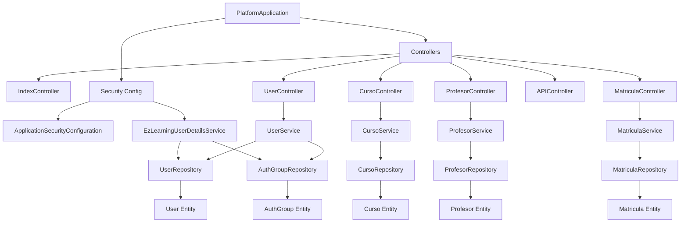

# Codebase Analysis

## Repository Overview
This repository contains a Spring Boot 2.1.x web application targeting Java 8 that delivers an e-learning platform with both server-side rendered views (Thymeleaf + Materialize CSS) and simple REST endpoints for listing courses and professors. It supports two profiles: development with H2 in-memory DB and production with MySQL, with Flyway-based migrations for schema and reference data. Authentication and authorization are implemented with Spring Security (form login, role-based access to controllers). The app is deployable to environments like Heroku and can point to AWS RDS for the MySQL database in production.

Key highlights:
- Spring Boot 2.1.8.RELEASE; Java 8 target
- MVC controllers for pages and CRUD flows for Curso and Profesor
- REST endpoints under /api for listing profesores and cursos
- Spring Security using DaoAuthenticationProvider and BCrypt with UserDetailsService
- Profiles: dev (H2) and prod (MySQL) with environment-driven configuration
- Flyway SQL migrations for schema and seed data

## Project Structure and Modules
The project is a single Spring Boot module (Maven) with standard layout:

- src/main/java
  - com.ezlearning.platform.PlatformApplication: Spring Boot entrypoint
  - com.ezlearning.platform.security.ApplicationSecurityConfiguration: Security config
  - com.ezlearning.platform.auth: Authentication domain: User, AuthGroup, repositories, and UserDetailsService
  - com.ezlearning.platform.controller: MVC + REST controllers (Index, User, Curso, Profesor, Matricula, API)
  - com.ezlearning.platform.model: Domain entities for course (Curso), enrollment (Matricula), and professor (Profesor)
  - com.ezlearning.platform.repositories: Spring Data JPA repositories for Curso, Matricula, Profesor
  - com.ezlearning.platform.dto: DTOs for Curso, Matricula, Profesor (typo as ProfesotDto), and User
  - com.ezlearning.platform.services.core.impl: Services for Curso, Profesor, Matricula, User
- src/main/resources
  - application.properties (activates profile via APP_PROFILE)
  - application-dev.properties (H2 config)
  - application-prod.properties (MySQL config via env vars)
  - db/migration: Flyway migrations (V1.1__schema.sql, V1.2__data.sql)
  - templates: Thymeleaf views for pages and CRUD flows
  - static: Materialize CSS, JS, images

Observations:
- Controllers mix view rendering and role checks, while a small REST surface exists under /api.
- Services encapsulate creation, update, patch, and delete operations for domain objects.
- Lombok is used across entities/services to reduce boilerplate.

## Dependencies and Third-Party Services
Maven Dependencies (pom.xml):
- Spring Boot Starter Web, Thymeleaf, Data JPA, Security, DevTools
- Thymeleaf Extras Spring Security 5
- H2 (runtime, dev)
- MySQL Connector/J
- Flyway Core
- Lombok (optional)
- Spring Boot Starter Test (test scope)

Third-Party/External Services:
- H2 Database (in-memory for dev)
- MySQL (prod)
- Flyway for DB migrations
- Typical deployment targets: Heroku (as per README), MySQL on AWS RDS

## Build and Configuration (Maven, profiles, env)
Build:
- Parent: spring-boot-starter-parent 2.1.8.RELEASE
- Java version: 1.8
- Plugin: spring-boot-maven-plugin

Configuration:
- application.properties: spring.profiles.active uses APP_PROFILE env var (defaults to dev)
- application-dev.properties: H2 JDBC URL, console enabled, show-sql=true
- application-prod.properties: MySQL driver and JDBC URL, username, password pulled from DB_URL, DB_USERNAME, DB_PASSWORD env vars
- JPA: spring.jpa.hibernate.ddl-auto=none (schema managed by Flyway)

Implications:
- Local dev is easy with in-memory H2 and H2 console (must be allowed through security)
- Production requires setting DB_URL/DB_USERNAME/DB_PASSWORD environment variables

## Framework Usage (Spring Boot, Spring Security, Thymeleaf, Materialize)
Spring Boot:
- Auto-configuration with @SpringBootApplication in PlatformApplication

Spring Security:
- WebSecurityConfigurerAdapter used (legacy style for Spring Security <=5.6)
- DaoAuthenticationProvider with custom EzLearningUserDetailsService
- BCryptPasswordEncoder(11) configured directly in provider
- SimpleAuthorityMapper converts roles to uppercase and default authority USER
- http: csrf disabled, frameOptions disabled, permits static and public pages, form login at /login, logout via AntPathRequestMatcher("/logout") to /logout-success
- Method-level security enabled with @EnableGlobalMethodSecurity(prePostEnabled = true); numerous @PreAuthorize in controllers

Thymeleaf:
- Views in templates/, fragments included, forms for login/register/edit; leverages thymeleaf-extras-springsecurity5 for security-aware views (dependency present)

Materialize:
- Static assets under static/css and static/js; pages reference Materialize classes/components

## Database and Migrations (H2/MySQL, Flyway)
Profiles:
- dev: H2 in-memory DB; console enabled; Hibernate dialect set to H2; show-sql enabled
- prod: MySQL 8 driver, JDBC URL/credentials via env

Flyway:
- V1.1__schema.sql defines tables: user, auth_user_group, profesor, curso, matricula
- V1.2__data.sql seeds users/demo, roles, professors, and courses, plus sample matriculas

Schema mapping notes:
- Table names and column names are lowercase in schema (user, auth_user_group, etc.) while JPA entities use @Table(name="user") and AuthGroup @Table(name="AUTH_USER_GROUP") with uppercase column names. MySQL usually treats names case-insensitively on Windows/macOS but case-sensitive on some Linux setups. Ensure consistency or configure Hibernate naming/SQL scripts accordingly to avoid portability issues.

## REST API Surface (Controllers and Endpoints)
Public REST endpoints (APIController):
- GET /api/profesores -> List<Profesor>
- GET /api/cursos -> List<Curso>

Thymeleaf/MVC pages (subset):
- GET /, /index -> index view (public)
- GET /discover -> discover view (public)
- GET /login, /logout-success -> login/logout pages (public)
- User registration:
  - GET /register -> registration form (public)
  - POST /register -> create user (public)
- Cursos (CursoController):
  - GET /cursos -> list courses (public in security config)
  - GET /cursos/{id} -> course detail (ROLE_USER)
  - GET/POST /cursos/add/{id_profesor} (ROLE_ADMIN)
  - GET /cursos/edit/{id_curso} (ROLE_ADMIN)
  - POST /cursos/edit/{id_profesor}/{id_curso} (ROLE_ADMIN)
  - GET /cursos/delete/{id_curso} (ROLE_ADMIN)
- Profesores (ProfesorController):
  - GET /profesores -> list (ROLE_USER)
  - GET /profesores/{id_profesor} -> detail (ROLE_USER)
  - GET /profesores/add, POST /profesores/save (ROLE_USER)
  - GET /profesores/edit/{id_profesor}, POST /profesores/update/{id_profesor}, GET /profesores/delete/{id_profesor} (ROLE_ADMIN)
  - POST /profesores/patch/{id_profesor} (no preauthorize annotation; likely should be restricted)
- Matricula (MatriculaController):
  - GET /matricula/save/{id_curso} (ROLE_USER)

Note: The security config permits "/cursos" publicly, but detailed course view "/cursos/{id}" requires ROLE_USER via @PreAuthorize. Some Profesor endpoints require ROLE_USER to create, and ROLE_ADMIN to edit/delete.

## Code Quality Metrics (complexity, duplication, dead code)
Static review notes:
- Controllers are relatively straightforward and thin; they defer to repositories/services, reducing complexity per method.
- Services encapsulate business logic; UserService handles validation and password encoding; logging is minimal.
- Duplication is low; patterns for CRUD operations across Curso/Profesor are consistent.
- Potential dead code:
  - In UserService, logging lines around image upload are placeholders and not connected to an actual upload implementation.
  - ProfesotDto naming suggests a typo; review usage and rename to ProfesorDto for clarity.
- DTO vs Entity consistency:
  - Some update flows accept entity directly in controller methods (e.g., ProfesorController.updateProfesor takes Profesor). For consistency and validation, prefer DTO + mapping.
- Null handling:
  - Many repository.findById(...).get() calls can throw NoSuchElementException; consider orElseThrow with custom error and proper 404 handling.
- Exception handling:
  - Controllers catch Exception broadly and route to an error view; consider centralized @ControllerAdvice for error handling.

Indicative hotspots:
- Security annotations and URL patterns must be kept in sync; current mismatch on some endpoints (see Security Review).
- Case sensitivity between JPA mappings and Flyway DDL may cause issues across environments.

## Security Review (auth, roles, input validation, secrets)
Authentication/Authorization:
- DaoAuthenticationProvider with custom UserDetailsService backed by User and AuthGroup entities
- Roles are uppercase, SimpleAuthorityMapper set convertToUpperCase true; default authority USER
- BCryptPasswordEncoder(11) used during registration and config
- CSRF disabled globally; frameOptions disabled to allow H2 console

Access Control:
- Public paths: "/", "/index", "/discover", "/cursos", "/h2-console/**", "/api/**", "/register", "/css/**", "/js/**", "/img/**"
- All other requests require authentication; method-level @PreAuthorize additionally restricts many controller methods

Potential Issues and Observations:
- CSRF disabled: For form-based login and session cookies, disabling CSRF exposes risk to CSRF attacks on state-changing endpoints (POST/GET that modify state). Consider enabling CSRF and excluding only APIs or using stateless JWT for APIs.
- H2 console: Permitted by security, acceptable for dev profile. Ensure it is disabled/not exposed in prod profile; currently exposure is gated only by URL pattern, not profile.
- Role naming and checks:
  - @PreAuthorize mostly uses hasRole('ROLE_*'). With SimpleAuthorityMapper converting to uppercase and default USER, existing roles "USER" and "ADMIN" are fine. Note Spring's hasRole expects role without prefix when using default ROLE_ prefix; here the code uses hasRole('ROLE_ADMIN'), which relies on a GrantedAuthority with ROLE_ROLE_ADMIN if default prefixing occurs. However, because SimpleAuthorityMapper does not add the ROLE_ prefix automatically, ensure that UserPrincipal is assigning authorities with "ROLE_ADMIN" or the checks align. Review UserPrincipal implementation (not included in provided listing) to ensure authority names match checks.
- ProfesorController.patch endpoint lacks @PreAuthorize, making it publicly callable by any authenticated or even unauthenticated user depending on the path authorization; since "/profesores/**" is not whitelisted, it still requires authentication, but role restriction is missing. Add appropriate role.
- Input validation: Controllers accept DTOs/entities with no bean validation annotations (@Valid) or binding result checks. Potential for invalid data, and no server-side sanitization for fields like imgurl/descripcion/detalle which are rendered in templates.
- Error handling: Generic exception catch with model.addAttribute("error", e) risks leaking exception details. Prefer user-friendly messages and structured error pages.
- Secrets and config: application-prod.properties references env vars for DB credentials, which is good. No hard-coded secrets found.
- Password policies: No explicit password strength validation in registration.

## Testing Overview (unit/integration coverage, gaps)
- Only a contextLoads test present (PlatformApplicationTests). No unit or integration tests for controllers, services, repositories, or security.
- Gaps:
  - Authentication/authorization tests
  - Service logic tests (UserService createUser duplicates)
  - Repository tests (custom finders)
  - MVC tests for controllers and view names
  - Integration tests for Flyway migrations against H2 and MySQL

## Operational Concerns (logs, config, profiles, Heroku/AWS RDS readiness)
- Logging: Limited usage (IndexController logs). No centralized logging configuration; default Spring Boot logging applies.
- Profiles: APP_PROFILE controls active profile; dev vs prod configs are simple and clear.
- Flyway: With spring.jpa.hibernate.ddl-auto=none, schema is migration-driven; good for prod.
- Heroku: README indicates hosting; for Spring Boot 2.1 + Heroku, ensure correct server.port and JDBC URL mapping. DB_URL env var should reflect Heroku ClearDB or custom MySQL on AWS RDS.
- H2 console: Should be disabled in production; currently only enabled in application-dev.properties, but security permits /h2-console/** globally. The console will not be available without H2 and config, but it is better to restrict via security based on active profile.
- Static resources and caching: No explicit caching headers configuration; default static handling applies.

## Dependency Graph (High-Level)
Mermaid Graph of primary components and dependencies:



## Code and Configuration Findings (Java 8, Spring Boot 2.1)
- Java 8 compatible; Streams/Optionals could be used more consistently (many Optional.get() calls)
- WebSecurityConfigurerAdapter is used; fine for 2.1, but deprecated in newer versions (note for future upgrade)
- Thymeleaf + extras align with SB 2.1
- BCrypt strength 11 is reasonable for 2019-era defaults; consider revisiting based on current CPU capacity

## Recommendations and Actionable Fixes
Prioritized by impact:

High
1) Re-enable CSRF protection for form-based endpoints
   - Action: Enable CSRF in HttpSecurity and use Thymeleaf csrf tokens in forms. If API endpoints should remain stateless, consider excluding /api/** or using CSRF tokens there as well.
   - Rationale: Prevent CSRF attacks on state-changing endpoints.

2) Fix role/authority mapping consistency
   - Action: Review UserPrincipal and ensure granted authorities match controller checks. Prefer @PreAuthorize("hasRole('ADMIN')") style and grant "ROLE_ADMIN"/"ROLE_USER" authorities accordingly, or use hasAuthority with exact strings.
   - Rationale: Prevent unexpected authorization bypass/lockout.

3) Secure ProfesorController.patch
   - Action: Add @PreAuthorize on POST /profesores/patch/{id_profesor}, likely ROLE_ADMIN or at least ROLE_USER with ownership checks.
   - Rationale: Prevent unauthorized content modification.

4) Replace Optional.get() calls
   - Action: Use repository.findById(id).orElseThrow(() -> new NotFoundException(...)) and return 404 or error view appropriately.
   - Rationale: Avoid NoSuchElementException and improve error handling.

Medium
5) Input validation with Bean Validation
   - Action: Add javax.validation annotations to DTOs (e.g., @NotBlank, @Email, @URL) and use @Valid in controller method parameters with BindingResult handling.
   - Rationale: Ensure data quality and reduce attack surface.

6) Centralize exception handling
   - Action: Add @ControllerAdvice with @ExceptionHandler to translate exceptions to user-friendly pages or JSON.
   - Rationale: Avoid leaking stack traces and unify error responses.

7) H2 console restriction
   - Action: In security config, permit /h2-console/** only when active profile is dev; or move the permitAll for /h2-console/** behind a profile check.
   - Rationale: Prevent accidental exposure in production.

8) Align JPA entity/table and Flyway schema naming
   - Action: Make table/column names consistent (case and exact names) across entities and SQL migration scripts. For MySQL on Linux, ensure lower_case_table_names or SQL matches exact case.
   - Rationale: Prevent production build/run issues.

9) Strengthen password policies
   - Action: Validate password length/complexity in UserDto and provide feedback on registration page.
   - Rationale: Enhance account security.

10) Add tests
   - Action: Add unit tests for services and repositories; add Spring MVC tests for controllers; add integration tests to validate Flyway migrations on H2 and (optional) Testcontainers MySQL.
   - Rationale: Increase reliability and regression safety.

Low
11) Logging improvements
   - Action: Add structured logs in service layer; configure log levels per profile; consider correlation IDs for requests.
   - Rationale: Improve observability.

12) DTO naming consistency
   - Action: Rename ProfesotDto to ProfesorDto and refactor references.
   - Rationale: Code readability and maintainability.

13) Security headers
   - Action: Re-enable frameOptions except in dev for H2; add Content-Security-Policy (CSP) headers adjusted for Materialize and assets.
   - Rationale: Mitigate clickjacking/XSS risks.

14) API evolution
   - Action: Expand REST API with pagination and filtering; document using Spring REST Docs or OpenAPI.
   - Rationale: Improve API usability.

## Example Configuration Changes (Illustrative)
Enable CSRF with Thymeleaf:
```java
@Override
protected void configure(HttpSecurity http) throws Exception {
    http
      .headers().frameOptions().sameOrigin() // allow H2 console frames on dev only
      .and()
      .authorizeRequests()
        .antMatchers("/", "/index", "/discover", "/cursos", "/api/**", "/register", "/css/**", "/js/**", "/img/**").permitAll()
        .anyRequest().authenticated()
      .and()
      .formLogin()
        .loginPage("/login").permitAll()
      .and()
      .logout()
        .invalidateHttpSession(true)
        .clearAuthentication(true)
        .logoutRequestMatcher(new AntPathRequestMatcher("/logout"))
        .logoutSuccessUrl("/logout-success").permitAll();
    // Do not call csrf().disable(); keep CSRF enabled for form endpoints
}
```

Add @PreAuthorize to patch endpoint:
```java
@PostMapping("/patch/{id_profesor}")
@PreAuthorize("hasRole('ROLE_ADMIN')")
public String patchProfesor(@PathVariable Long id_profesor, Profesor profesor, RedirectAttributes attributes, Model model) {
   ...
}
```

Replace Optional.get():
```java
Profesor profesorActual = profesorRepository.findById(id_profesor)
    .orElseThrow(() -> new EntityNotFoundException("Profesor not found: " + id_profesor));
```

## Appendix: Detected Frameworks/Libraries
- Spring Boot 2.1.8.RELEASE, Spring MVC, Spring Data JPA, Spring Security
- Thymeleaf + thymeleaf-extras-springsecurity5
- Flyway Core
- H2 Database, MySQL (Connector/J)
- Lombok
- Materialize CSS (static assets)

## Sources
This analysis references the following files:
- pom.xml
- src/main/java/com/ezlearning/platform/security/ApplicationSecurityConfiguration.java
- src/main/java/com/ezlearning/platform/controller/APIController.java
- src/main/java/com/ezlearning/platform/controller/CursoController.java
- src/main/java/com/ezlearning/platform/controller/ProfesorController.java
- src/main/java/com/ezlearning/platform/controller/MatriculaController.java
- src/main/java/com/ezlearning/platform/controller/IndexController.java
- src/main/java/com/ezlearning/platform/controller/UserController.java
- src/main/java/com/ezlearning/platform/services/core/impl/UserService.java
- src/main/java/com/ezlearning/platform/auth/EzLearningUserDetailsService.java
- src/main/java/com/ezlearning/platform/auth/User.java
- src/main/java/com/ezlearning/platform/auth/AuthGroup.java
- src/main/java/com/ezlearning/platform/auth/UserRepository.java
- src/main/java/com/ezlearning/platform/auth/AuthGroupRepository.java
- src/main/resources/application.properties
- src/main/resources/application-dev.properties
- src/main/resources/application-prod.properties
- src/main/resources/db/migration/V1.1__schema.sql
- src/main/resources/db/migration/V1.2__data.sql
- src/test/java/com/ezlearning/platform/PlatformApplicationTests.java
- README.md
