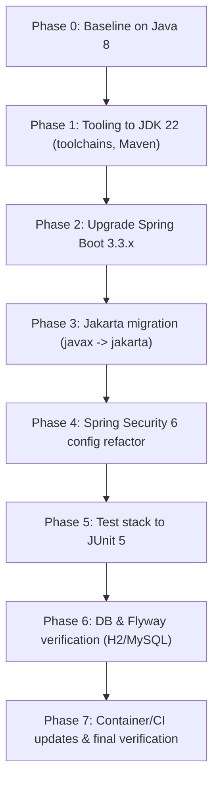

# Java 8 to Java 22 Migration: Architecture and Approach

## Goals and Scope

The goal is to migrate the ez-learning Spring Boot + Thymeleaf application from Java 8 to Java 22 safely and predictably. The migration must preserve functionality, modernize the platform to a supported Spring Boot line, and position the app for future enhancements.

Key scope:
- Adopt Java 22 for build and runtime.
- Upgrade to Spring Boot 3.3.x (supports Java 22).
- Move from javax.* to jakarta.* packages where required.
- Modernize Spring Security configuration (Security 6).
- Keep deployment simple; default to classpath (no JPMS modules).
- Update build pipeline and container runtime.

Non-goals:
- Re-architecting business logic or UI.
- Adopting all new language features at once (they can be phased in).

## JDK 22 Toolchain

- Maven Toolchains: Use a toolchains.xml to ensure Maven builds with JDK 22 even if other JDKs are installed locally.
- Maven version: Use Maven 3.9.x+ for best plugin compatibility.
- Compiler target: Configure the compiler to use release 22, producing Java 22 bytecode.

Recommended toolchains.xml (see implementation details document for full content):
- Location: .mvn/toolchains.xml
- JDK vendor: any (e.g., eclipse-temurin)
- Version: 22

## Classpath vs Module Path

Decision: Stay on the classpath.

Rationale:
- The Spring ecosystem and third-party libraries used here commonly run on the classpath without explicit JPMS modules.
- Introducing JPMS modules adds complexity without immediate benefits for this application.
- A future, optional phase can consider modularization if desired.

## Preview Features Policy

- Do not enable Java preview features.
- Only use standard Java 22 features and library APIs.

## Bytecode Target and Compatibility

- Set maven-compiler-plugin <release> to 22.
- No multi-release JARs are required.
- Ensure Lombok version is compatible with Java 22.

## GC Considerations

- Default GC is adequate for this workload (G1GC). No special GC flags required.
- Monitor performance after upgrade; consider tuning only if you observe GC-related issues in production.

## Container Runtime Image Selection

- For Dockerized deployments, use an up-to-date JRE/JDK 22 image such as:
  - eclipse-temurin:22-jre (for runtime) or eclipse-temurin:22 (for build stages)
- For Spring Boot layered jars, you can also rely on buildpacks (Paketo) to produce an optimized OCI image:
  - mvn -DskipTests spring-boot:build-image
- Keep image selection aligned with your CI/CD base images.

## Build Pipeline Changes

- Update Maven Wrapper to a recent Maven (e.g., 3.9.6): mvn -N wrapper -Dmaven=3.9.6
- Add .mvn/toolchains.xml to pin JDK 22 builds consistently.
- Upgrade Spring Boot parent to 3.3.x and migrate to Jakarta.
- Upgrade Surefire/Failsafe and Compiler plugins for Java 22/JUnit 5.
- Ensure CI uses JDK 22 and caches Maven repository appropriately.

## Spring Boot 3.3.x and Jakarta Migration

- Replace javax.persistence.* with jakarta.persistence.* in entity classes.
- Ensure any javax.validation.* annotations (if added) become jakarta.validation.*.
- Boot 3 removes legacy/deprecated APIs. Review application entry points and configs; main application remains the same.

## Spring Security 6 Migration

- Replace WebSecurityConfigurerAdapter with a @Bean SecurityFilterChain and the new lambda-based DSL.
- Replace antMatchers with requestMatchers.
- Replace @EnableGlobalMethodSecurity with @EnableMethodSecurity.
- Keep BCryptPasswordEncoder; define PasswordEncoder as a bean.
- AuthenticationManagerBuilder usage is replaced with provider beans and AuthenticationConfiguration.

## Database and Migrations

- H2 dev profile continues to use org.h2.Driver; version will be 2.x via Boot 3.3.x.
- MySQL prod profile: continue using com.mysql.cj.jdbc.Driver (already configured).
- Flyway upgraded to 10.x; migration scripts under db/migration remain unchanged. Test both H2 and MySQL migrations after upgrade.

## Testing

- Migrate to JUnit 5 (Jupiter).
- surefire 3.2.5 runs Jupiter tests out of the box.
- Replace @RunWith(SpringRunner.class) with native Jupiter annotations.

## Observability, Logging, and Exceptions

- Keep SLF4J + Logback defaults (Boot 3).
- Consider adopting @ControllerAdvice and problem-details style responses in future phases.
- For now, preserve current behavior and incrementally improve logging patterns.

## Migration Flow (High-Level)

## Acceptance Criteria

- Project compiles and runs on Java 22 locally (dev profile) and in CI.
- All tests pass under JUnit 5.
- Security configuration is migrated and functional.
- Flyway migrations run cleanly on both H2 (dev) and MySQL (prod).
- Deployment image uses Java 22.
